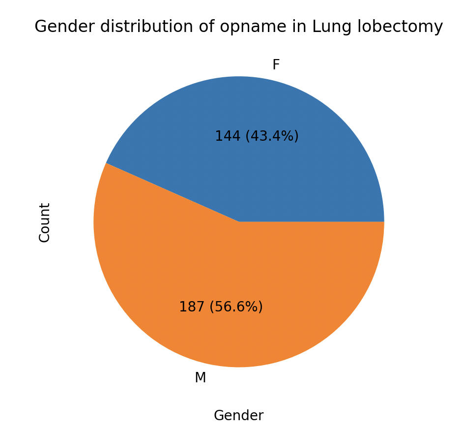

# Dataset Overview

This repository contains a dataset from [PhysioNet](https://physionet.org/content/vitaldb/1.0.0/): VitalDB,
a high-fidelity multi-parameter vital signs database in surgical patients.

Data Features:

- Patient demographics
- Medical history
- Surgical information: anesthesia and operation time, surgical approach
- Physiological data.

This repository provides tools for preprocessing and analyzing this data, focusing on handling missing values,
encoding categorical variables, and scaling numerical features.

# Python

---

# Installation

- Create environment for the required dependencies

```
conda create -n pyphysionet python~=3.9.0
conda activate pyphysionet
cd [CLONED_DIRECTORY]
pip install -r requirements.txt
```

- Buildup the src path

```
conda install conda-build
conda develop src
cd src
```

# Pre-processing

- Identify patients with abnormal_data

`` from src.clinical_data import abnormal_data``

- Filter patients by abnormal lab results

`` from src.clinical_data import select_data``

- Filter patients by ASA level

`` from src.clinical_data import select_asa``

- View patient-specific abnormal data

`` from src.clinical_data import select_pt``

- Identify patients with pre-op diabetes (DM) or hypertension (HTN)

`` from src.clinical_data import medical_history``

- Calculate average anes and op time.

`` from src.clinical_data import anes_op_time``

# Statistical Analysis

## Chi-square analysis

Perform chi-square tests to check if two categorical variables are related or independent.

example usage

```
from statistics import chi2

chi2(df,
     dependent_var='death_inhosp',
     independent_var=['preop_htn', 'sex']
     )
```

# Data visualisation

example usage

```
from visulisaion import figure_by_gender

figure_by_gender(df, 
                 bar_chart=False, # to create a bar chart if it is True
                 pie_chart=True, # to create a pie chart if it is True
                 filter_col='opname', # any column to filter on
                 filter_val='Lung lobectomy') # any value to filter on 
```



# SAS

---

# Installation

Using [SAS OnDemand for Academics](http://welcome.oda.sas.com)

# Usage

- To create a library named surg ``libname_surg.sas``
- To import CSV file into a SAS dataset ``csv_to_sas.sas``
- To standardise variable name and mapping raw data to CDISC SDTM (Study Data Tabulation Model), including
  Demographics, Adverse Events, and Laboratory Results
  ``clinical_data.sas``
- To create a macro variable for output ``ouput_path.sas``
- To create Frequency Report, Plots ``exploring_data.sas``

# Contact

Wei Jan Chang, weijanchang@rcsi.ie
